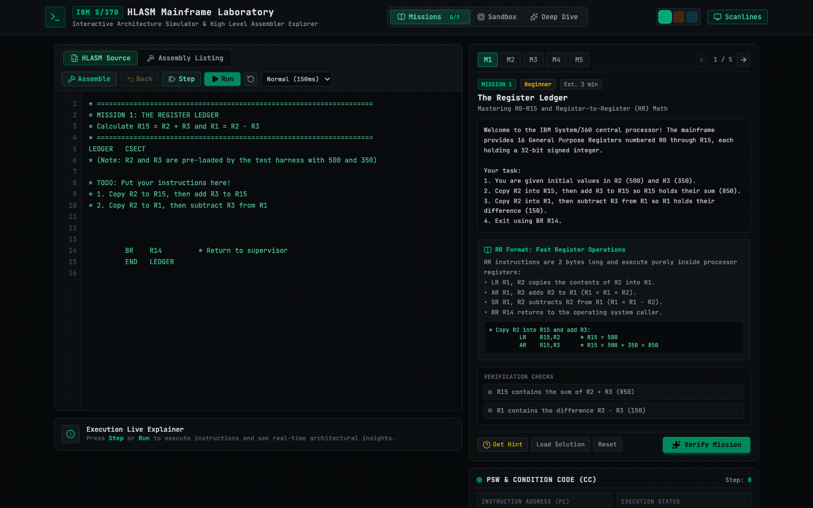
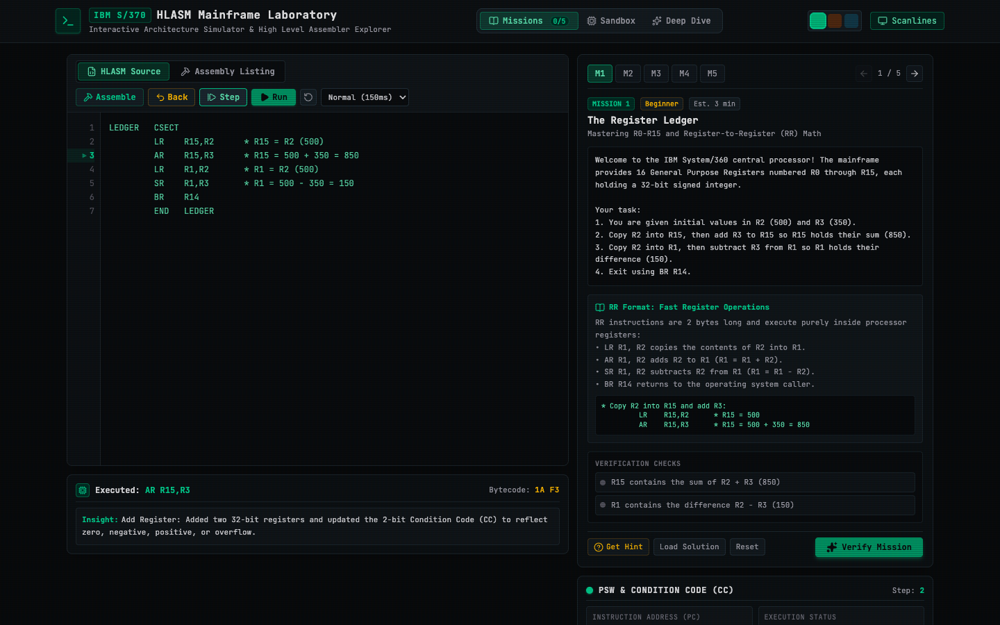
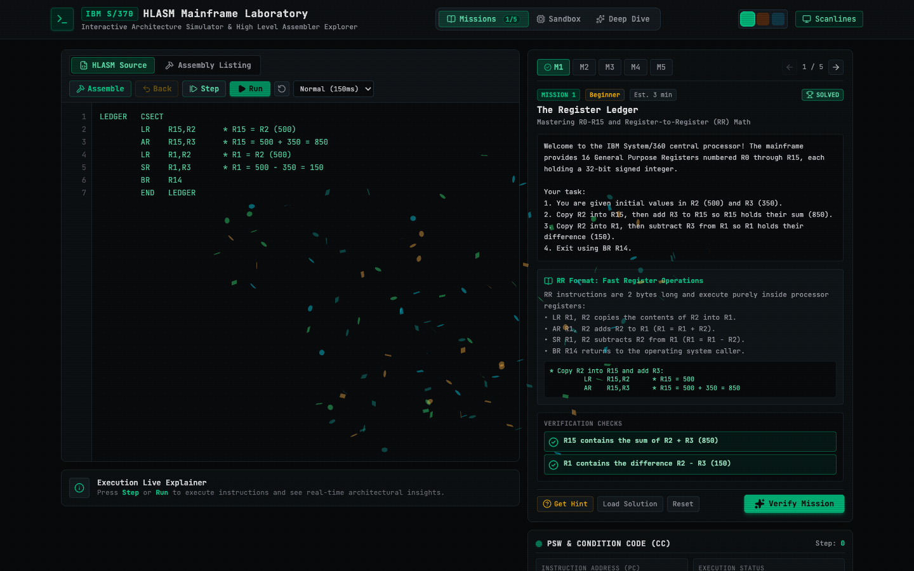
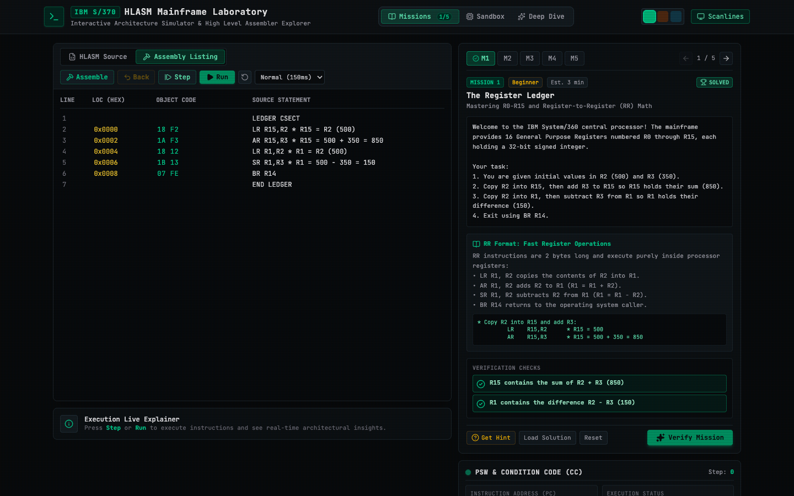
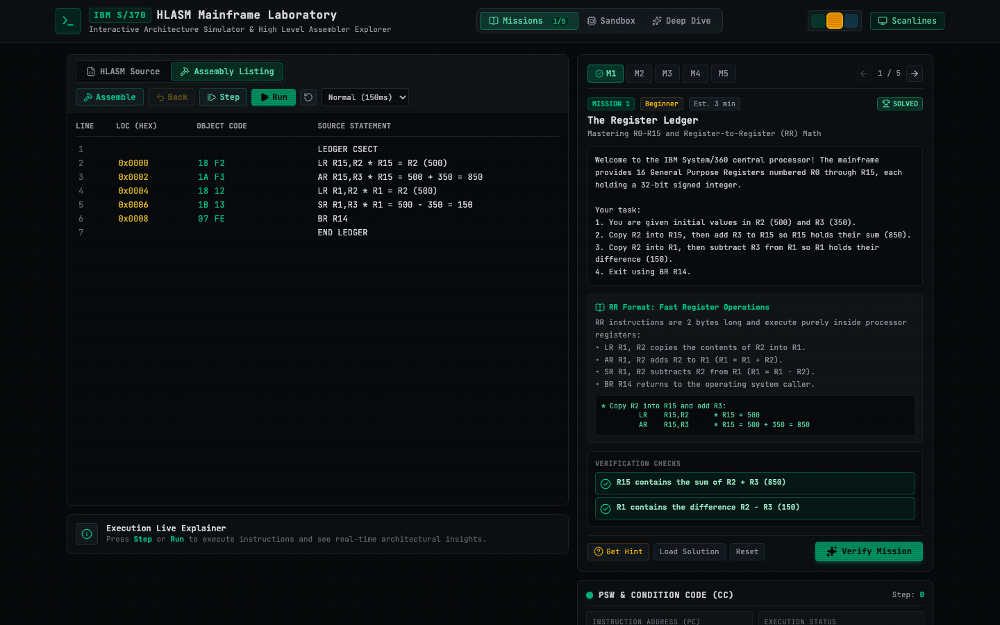
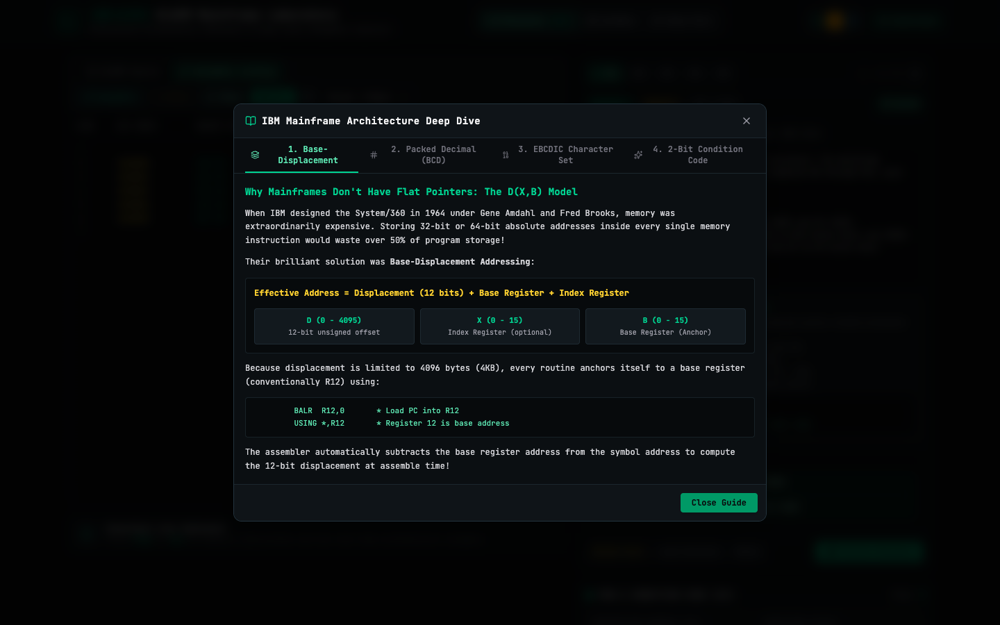
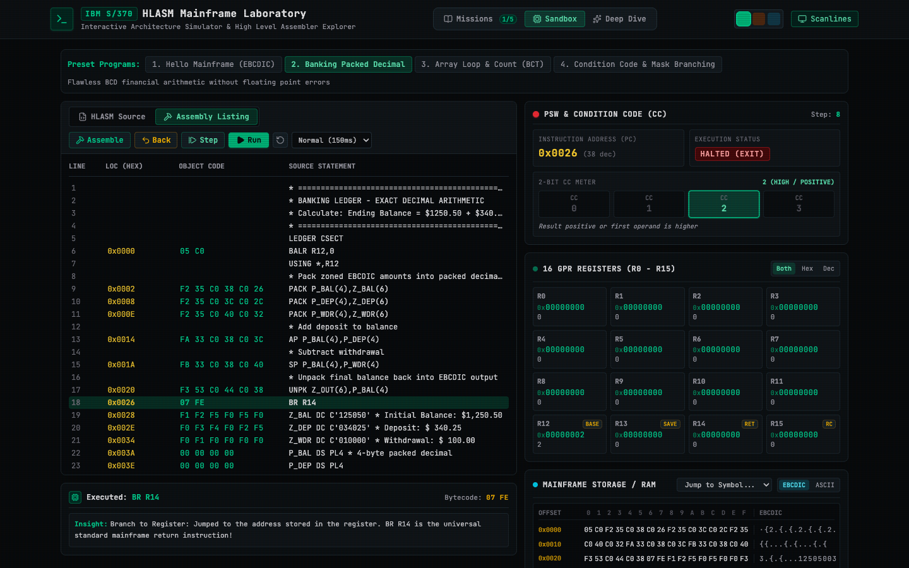

# 📟 IBM Mainframe HLASM Lab

> **An interactive, educational simulator for IBM System/370 & z/Architecture High Level Assembler (HLASM).**  
> Built as a playful, visual retro-computing laboratory to sit alongside modern CS compiler projects.

[](./src/core/engine.test.ts)
[](./src/core/cpu.ts)
[](./src/App.tsx)
[](./docs/demo.webm)

---

## 🎥 Walkthrough Video & Demo

https://github.com/user-attachments/assets/demo.webm *(Download/view the silent video walkthrough in [`docs/demo.webm`](./docs/demo.webm))*

The recorded demonstration shows:
1. Selecting **Mission 1: The Register Ledger** and inspecting the briefing.
2. Typing the HLASM solution in the editor (`LR`, `AR`, `SR`).
3. Assembling the bytecode with real-time symbol resolution.
4. Stepping through instructions with **Time-Travel (Undo)** support, observing `R15` register updates and 2-bit Condition Code changes.
5. Verifying the solution against automated assertions with celebratory confetti.
6. Switching to the **IBM SYSPRINT Assembly Listing** view and testing the **Amber CRT theme** and **Architecture Deep Dive**.

---

## 📸 Screenshots

### 1. Mainframe Laboratory Workbench (IBM 3270 Green Phosphor)


### 2. Live Instruction Stepping, Explainer Callout & Register Delta Highlights


### 3. Automated Mission Verification & Celebration


### 4. Authentic IBM SYSPRINT Assembly Listing


### 5. IBM Amber Phosphor CRT Theme


### 6. Interactive Architecture Deep Dive Guide


### 7. Banking Sandbox: Packed Decimal (BCD) Financial Math


---

## ⚡ The Premise

Over **70% of Fortune 500 financial transactions** and banking core ledgers still process on IBM Z mainframes. Yet 99% of modern software engineers have never encountered:
- **Base-Displacement Addressing (`D(X,B)`)** instead of flat 64-bit pointers
- **Hardware Packed Decimal (BCD)** that eliminates floating-point rounding errors (`0.1 + 0.2 === 0.3`)
- **Storage-to-Storage (SS)** string moves that bypass CPU registers entirely
- **EBCDIC** character encoding and 2-bit Condition Codes

**IBM Mainframe HLASM Lab** turns this legendary, often intimidating architecture into an approachable, visual, browser-based playground with guided educational missions, step-by-step execution, and full time-travel (undo) debugging.

---

## 🚀 Key Features

* **Authentic Two-Pass Assembler:**
  * Generates real IBM bytecode from HLASM source statements.
  * Location Counter (`LOC`), Symbol Table resolution, and automatic Base Register binding (`BALR R12,0` + `USING *,R12`).
  * Emits full IBM `SYSPRINT` Assembly Listings with Hex Object Code side-by-side with source code.
* **Mainframe Virtual CPU & Memory:**
  * **16 General Purpose Registers (R0 - R15):** 32-bit signed/unsigned registers with delta change highlights.
  * **Program Status Word (PSW):** Real-time 2-bit Condition Code meter (`0=Equal`, `1=Low`, `2=High`, `3=Overflow`).
  * **64 KB Big-Endian Storage:** Hex dump viewer + live IBM Code Page 037 EBCDIC character translation.
  * **Memory Delta Tracking:** Visual pulse animations showing exact read/write memory ranges per instruction.
* **Time-Travel Step-Back Debugging:**
  * Step forward (`F10`) or step backward in time with full CPU/register/memory undo snapshots.
* **5 Progressive Educational Missions ("Mainframe Cadet"):**
  1. *The Register Ledger:* Warmup with R0-R15 and Register-to-Register (`LR`, `AR`, `SR`) math.
  2. *The Anchor:* Understanding base-displacement addressing and the sacred `USING *,12`.
  3. *The 1964 EBCDIC String Transfer:* Storage-to-Storage (`MVC`) memory manipulation.
  4. *The Banker's Penny:* Eliminating financial rounding errors using `PACK`, `AP`, and `UNPK`.
  5. *The Tape Audit Loop:* Sequential batch processing with `LA`, index offsets, and Branch on Count (`BCT`).
* **IBM 3270 CRT Aesthetics:**
  * Authentic terminal look with selectable Green, Amber, or Cyan phosphor modes.
  * Optional CRT horizontal scanline shader overlay.
  * Live architecture explainer drawer breaking down instruction mechanics in plain English.

---

## 🏛️ Mainframe Architecture Highlights

### 1. Base-Displacement Addressing `D(X,B)`
Mainframe instructions allocate only 12 bits for a displacement ($0 \le D \le 4095$ bytes). Addresses are computed on the fly:
$$\text{Address} = \text{Displacement} + \text{Base Register} + \text{Index Register}$$

```assembly
         BALR  R12,0       * Load PC into R12
         USING *,R12       * Register 12 is base anchor
         L     R2,MYVAL    * Load memory into R2
         ST    R2,RESULT   * Store register to RAM
MYVAL    DC    F'100'
RESULT   DS    F
```

### 2. Hardware Packed Decimal (BCD)
In JavaScript or Python, `0.1 + 0.2` produces `0.30000000000000004`. In banking, this is illegal. Mainframes use **Packed Decimal**:
```assembly
         PACK  P_BAL(3),Z_BAL(4)   * Convert zoned EBCDIC to packed BCD
         PACK  P_DEP(3),Z_DEP(4)   * 2 digits per byte + sign nibble
         AP    P_BAL(3),P_DEP(3)   * Exact base-10 addition
         UNPK  Z_OUT(4),P_BAL(3)   * Convert back to display string
```

### 3. The 2-Bit Condition Code
Branching does not check disparate flags. The Program Status Word tracks a 2-bit CC:
* `0`: Equal / Zero / No Overflow
* `1`: First operand Low / Negative
* `2`: First operand High / Positive
* `3`: Arithmetic Overflow

---

## 🛠️ Tech Stack & Architecture

```
mainframe-assembly-lab/
├── docs/
│   ├── demo.webm              # Recorded video demonstration
│   └── screenshots/           # High-resolution application screenshots
├── src/
│   ├── core/
│   │   ├── assembler.ts       # 2-pass HLASM parser & bytecode generator
│   │   ├── cpu.ts             # Virtual CPU (16 GPRs, PSW, 64KB memory)
│   │   ├── ebcdic.ts          # IBM CP037 <-> ASCII translation tables
│   │   ├── packedDecimal.ts   # Hardware BCD PACK, UNPK, AP, SP engine
│   │   ├── challenges.ts      # 5 educational missions & test harness
│   │   ├── engine.test.ts     # Core engine Vitest unit tests
│   │   └── challenges.test.ts # Mission validation test suite
│   ├── components/
│   │   ├── Header.tsx         # Brand, mode toggle, phosphor CRT themes
│   │   ├── CodeEditor.tsx     # HLASM editor with line numbers & active PC
│   │   ├── RegisterGrid.tsx   # R0-R15 grid with hex/dec toggle
│   │   ├── PSWDisplay.tsx     # Instruction Counter & 2-bit CC meter
│   │   ├── MemoryViewer.tsx   # Hex dump + EBCDIC character viewer
│   │   ├── InstructionExplainer.tsx # Real-time architectural callout
│   │   ├── MissionPanel.tsx   # Guided challenge runner with assertions
│   │   └── ArchitectureModal.tsx # Interactive deep-dive guide
│   ├── App.tsx                # Main simulation workbench
│   └── index.css              # CRT scanlines & phosphor themes
```

---

## 🏃 Getting Started

### Prerequisites
* [Node.js](https://nodejs.org/) (v18+) or [Bun](https://bun.sh/)

### Installation & Development
```bash
# Clone the repository
git clone https://github.com/assafbar2/mainframe-assembly-lab.git
cd mainframe-assembly-lab

# Install dependencies
bun install   # or npm install

# Run development server
bun dev       # or npm run dev
```

### Running Tests
```bash
# Run all 17 unit tests (Assembler, CPU, BCD, Missions)
bun test      # or npm test
```

### Building for Production
```bash
# Generate optimized production bundle
bun run build # or npm run build
```

---

## 📜 Supported Instructions (Subset)

| Type | Instruction | Name | Description |
| :--- | :--- | :--- | :--- |
| **RR** | `LR`, `AR`, `SR`, `MR`, `DR`, `CR`, `XR`, `NR`, `OR` | Register Math | 32-bit register arithmetic, logic, and multiply/divide |
| **RR** | `BCR`, `BR`, `BER`, `BNER`, `BLR`, `BHR`, `BALR` | Branch Register | Branch to register or call subroutine |
| **RX** | `L`, `ST`, `A`, `S`, `C`, `LA`, `LH`, `STH`, `AH`, `SH` | Storage/Register | Memory access via Base-Displacement `D(X,B)` |
| **RX** | `BC`, `B`, `BE`, `BNE`, `BL`, `BH`, `BNL`, `BNH`, `BZ`, `BCT` | Branch Storage | Conditional jump or loop counter decrement |
| **SI** | `MVI`, `CLI`, `NI`, `OI`, `XI` | Storage Immediate | 1-byte immediate assignments and bitwise operations |
| **SS** | `MVC`, `CLC` | Storage to Storage | Character copy and compare up to 256 bytes |
| **SS** | `PACK`, `UNPK`, `AP`, `SP`, `CP` | Packed Decimal | Financial arithmetic with hardware decimal precision |
| **Pseudo** | `CSECT`, `USING`, `DROP`, `DC`, `DS`, `EQU`, `END` | Directives | Symbols, memory definitions, base anchors |

---

## 📄 License

MIT © [Assaf Barnir](https://github.com/assafbar2)
